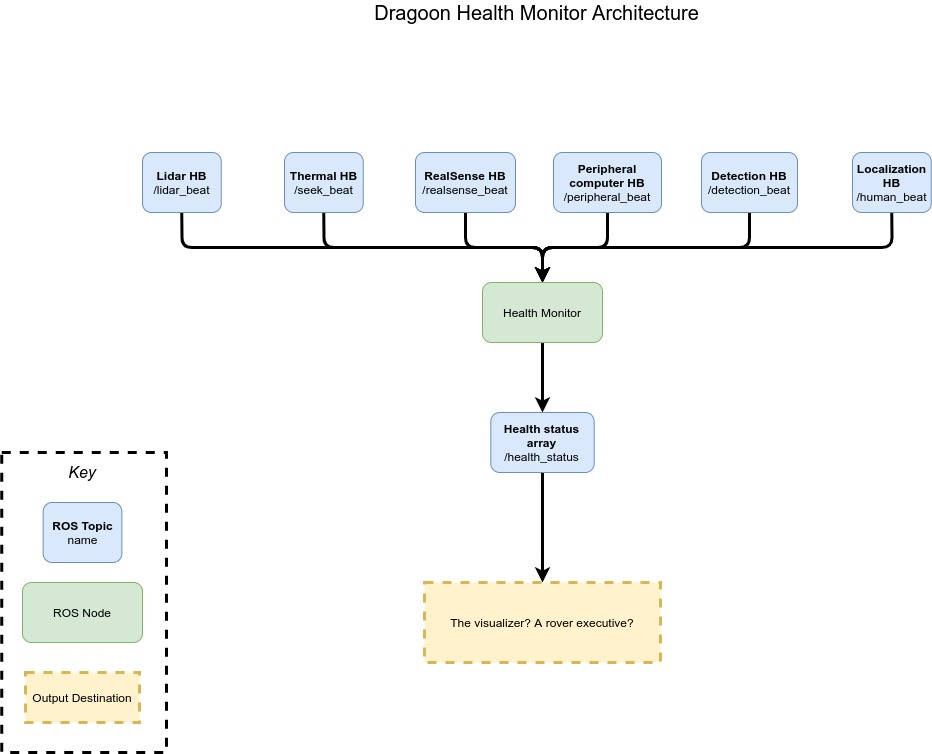

# Health Monitor

This is the watchdog that will monitor sensor heartbeats and alert users to any issues. The monitor reads data from subsystem topics, and then publishes the current health status to a health status topic. Currently, the monitor checks the health status at 20Hz, and each node is expected to send it status at 10Hz. 

There are several launch files in here right now. Anything with "faux" in front of it is a test of the health monitor node. These faux nodes simulate heartbeats from the various systems that the monitor is watching. 

## TODO List

1. Decide what happens with the output of the HM. Does it go to the visualizer? Or a rover executive?
2. Test with real sensor nodes 

## Architecture

### Inputs
The inputs are each heartbeat message from every active subsystem node. The user can also specify the rate that the health monitor runs at with a ROS param, shown in its [launch file](launch/health_monitor.launch).

### Outputs
An array of booleans of size `n`, where `n` is the number of heartbeats being listened too. In this array, False means that there is no heartbeat, and True means that there is. 

To determine what topic each system heartbeat should be published to, refer to this launch file [of global parameters](launch/health_global_params.launch). The DHM will use these parameters to select the topics it reads from. 
Here is an architecture for the system:

## Dependencies

1. dragoon_messages
